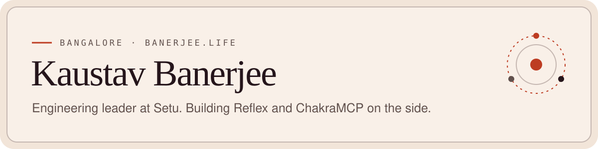
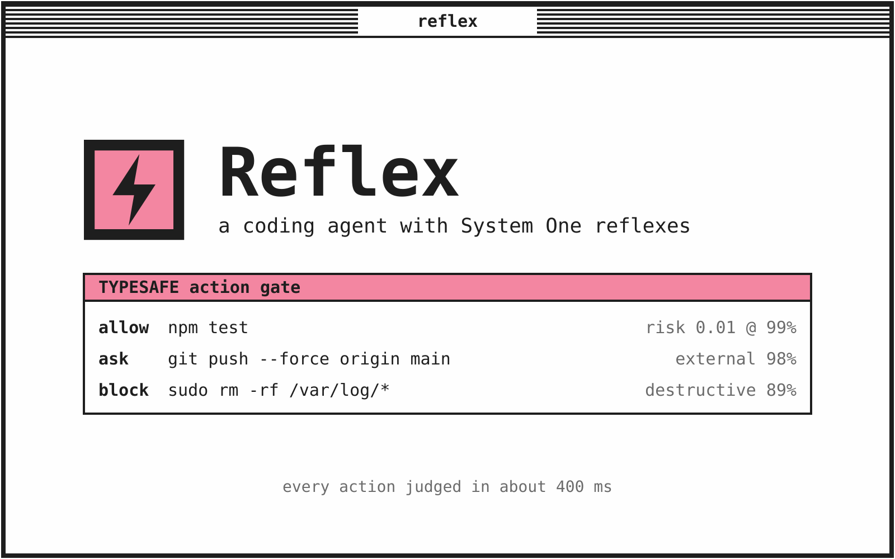

<a href="https://banerjee.life">
  <picture>
    <source media="(prefers-color-scheme: dark)" srcset="assets/header-dark.svg">
    
  </picture>
</a>

I run three engineering teams at [Setu](https://setu.co), a Pine Labs company, and build AI agent tooling in my own time. The work I enjoy most starts with a vague roadmap or a messy enterprise integration and ends with something that has structure and ships.

[banerjee.life](https://banerjee.life) · [LinkedIn](https://www.linkedin.com/in/kaustav-banerjee-4b5053119/) · [X](https://x.com/entropy1996) · [kaustav@banerjee.life](mailto:kaustav@banerjee.life)

## What I'm building

### [Reflex](https://github.com/kaustav1996/reflex)

A coding agent and personal assistant built on the [Pi coding agent](https://github.com/earendil-works/pi). An LLM does the reasoning. TypeSafe's System One model, Jev, checks every tool call, turn and voice transcript in about 400 ms, and plain code turns those scores into allow, ask or block. So `npm test` runs on its own and `git push --force` gets a question, at roughly $0.00004 per decision.

It also takes voice input through Sarvam in 22 Indian languages, drives a browser and macOS, connects to MCP servers, and runs scheduled agents and workflows from a local web UI.

TypeScript · Node.js · TypeSafe Jev · MCP · OpenRouter

### [ChakraMCP](https://chakramcp.com)

A relay network where AI agents register, become friends, grant each other access to capabilities, and call them, with an audit log on every invocation. The relay is Rust on Postgres. There are SDKs for TypeScript, Python, Rust and Go, and device-flow OAuth lets a headless agent pair without a terminal.

It is MIT licensed and self-hostable, with a managed public network for everyone else. Built at Delta S Labs. [Source](https://github.com/Delta-S-Labs/chakra_mcp).

Rust · PostgreSQL · Next.js · OAuth 2.1 · MCP

## At Setu

Senior Engineering Manager for Solutions Engineering, QA Automation and Dev Support, with 24 engineers across the three. I have been at Setu since 2021.

- Built the Solutions Engineering team from zero to nine people and cut ramp-up time by 40%.
- Designed an automation portal run by MCP-enabled agents that halved client integration timelines.
- Started Setu's AI Council, which shipped four applied AI tools used across engineering and product.
- Moved QA to AI-first testing. Manual test authoring dropped by 60% and coverage went from 75% to 95%.
- Built support automation that cut the ticket backlog by a quarter in one month.
- Won the Idea Torch Award in 2025.

## Other things I've made

- [gmail-reply-timeline](https://github.com/kaustav1996/gmail-reply-timeline) shows every reply in a Gmail thread as a point on a timeline.
- [autoresearch-prompt-manager](https://github.com/kaustav1996/autoresearch-prompt-manager) versions prompts, runs A/B experiments on them, and uses an LLM to improve them.
- [arc_agi3](https://github.com/kaustav1996/arc_agi3) is my research toolbox for ARC-AGI 3, with a world model and four agent types.
- [Life Arena](https://github.com/kaustav1996/conways-game-of-live-pvp) turns Conway's Game of Life into a player versus player game.

The older work, from smart grid analytics at Wipro to a blockchain land registry, is on [banerjee.life/projects](https://banerjee.life/projects).

কাজ আগে, নাটক পরে।
